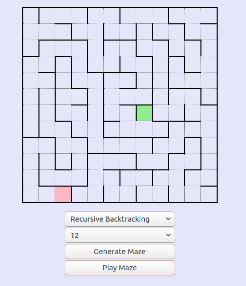

# Solvers and Generators

This site is the front-end for a number of different solver and generator animations such as mazes, Sudoku and Truchet tiles. The 5 sudoku solvers had over 15,000 boards solved to compare speed, and more than 100,000 mazes were generated for feature comparison. Code for the sudoku solvers is [here](https://github.com/rileythomp/sudoku) and maze generators [here](https://github.com/rileythomp/mazes).

https://solvergenerators.herokuapp.com/




To run:

```$ git clone https://gitlab.com/rileythomp14/solvers-generators```

```$ cd solvers-generators```

```$ ng serve```

